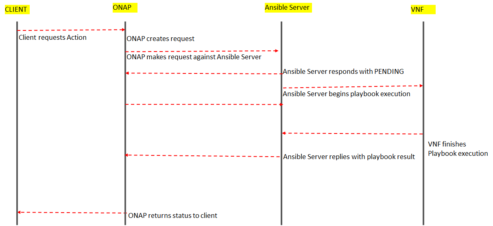
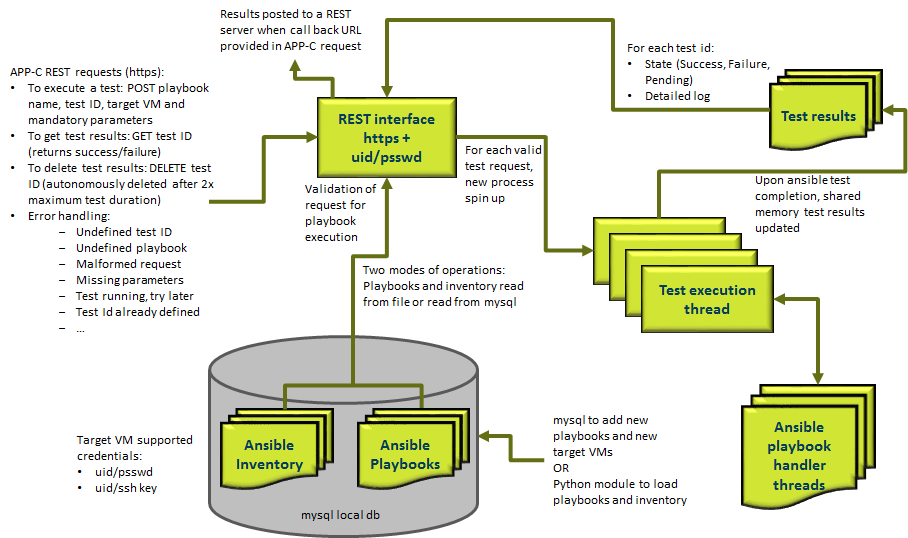
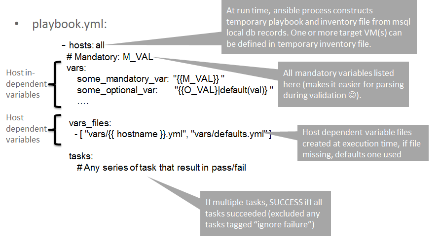
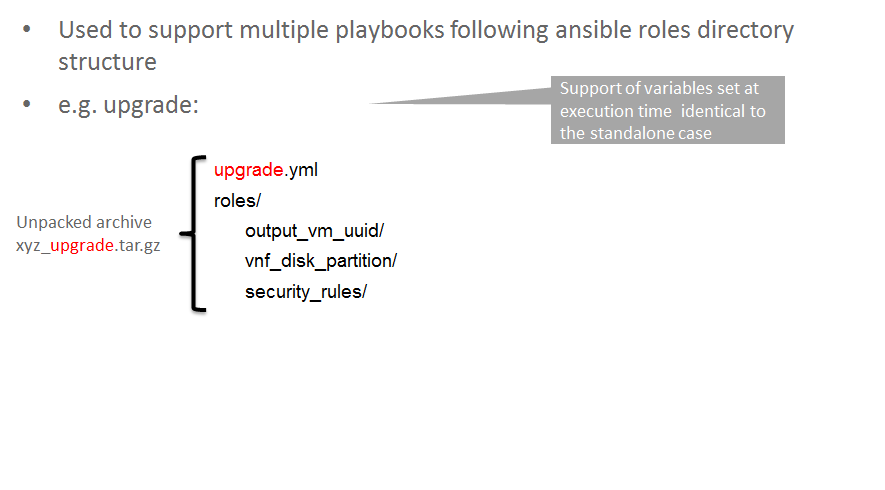
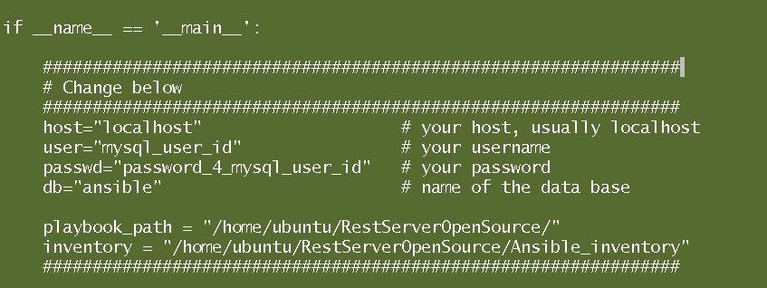
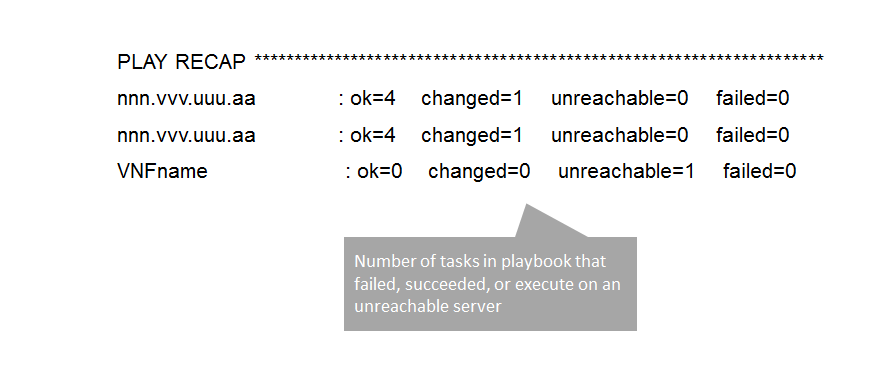

.. ============LICENSE_START==========================================
.. ===================================================================
.. Copyright © 2017 AT&T Intellectual Property. All rights reserved.
.. ===================================================================
.. Licensed under the Creative Commons License, Attribution 4.0 Intl.  (the "License");
.. you may not use this documentation except in compliance with the License.
.. You may obtain a copy of the License at
.. 
..  https://creativecommons.org/licenses/by/4.0/
.. 
.. Unless required by applicable law or agreed to in writing, software
.. distributed under the License is distributed on an "AS IS" BASIS,
.. WITHOUT WARRANTIES OR CONDITIONS OF ANY KIND, either express or implied.
.. See the License for the specific language governing permissions and
.. limitations under the License.
.. ============LICENSE_END============================================
.. ECOMP is a trademark and service mark of AT&T Intellectual Property.

==================================
APPC Ansible Adapter Documentation
==================================

This wiki provides documentation regarding the design, capabilities and
usage of the Ansible Extension for APP-C. Ansible_ is a an open-source
VNF management framework that allows provide an almost cli like set of
tools in a structured form. It is agentless in that the target VNF need
not have any additional software other than:

a) SSH server
b) Python >= 2.7 
c) Any necessary software that is specific to the VNF to run its functions. 

Any action (e.g configure, restart, health check etc) can be
executed on the VNF by constructing a **playbook (or set of playbooks)**
that is executed by an Ansible agent on the VNF via SSH.

The Ansible Extension for APP-C allows management of VNFs that support Ansible
through the following three additions :

 - **An APP-C/Ansible Server interface:** Ansible libraries are written in python and hence cannot be executed natively from within the APP-C Karaf container. Instead, the design calls for an **Ansible Server** that can execute the Ansible playbooks and exposes a **REST** interface that is compliant with requirements of APP-C. These requirements are documented as the Server API Interface that any compliant Ansible Server must support. Exact implementation of the Ansible Server is left open and does not affect APP-C operations as long as the server follows the interface. For purposes of evaluation, a reference web server that implements this APP-C/Ansible Server interface has been developed and the code is available from the App-C ONAP repository under *appc-adapters/appc-ansible-adapter/appc-ansible-example-server*.

 - **An APP-C Ansible adapter:** The ansible adapter is an OSGI bundle in the APP-C Karaf container that interacts with the Ansible Server . It is essentially a set of REST calls that performs two actions, submit request for a playbook to be executed, and if required get the results of the playbook after execution (if in synchronous mode).

 - **Ansible Directed Graph (DG):** The Ansible Directed graph is generic DG that can be used to invoke any playbook via Ansible (and hence any APP-C action, since in Ansible, VNF actions map to playbooks) corresponding to an LCM action.

The architecture design for supporting Ansible is outlined in the diagram below :

|image0|

The workflow envisioned when Application Controller receives an event is
as follows :

1) Application Controller receives event from the Event Bus for an LCM action.
2) The appropriate LCM API invokes the Dispatcher which performs the relevant lookups for A&AI and Workflow (DG information).
3) The dispatcher calls the DG relevant to the LCM action (for the VNF).
4) The DG conducts any processing of data (e.g retrieving additional information, filling templates etc) , prepares the necessary DG context variables outlined in Table 1 and then invokes the Ansible DG.
5) Ansible DG leverages the Ansible Adapter to interact with the Ansible Server.
6) Ansible Server invokes the appropriate playbook which in turn interacts with the VNF and then returns the playbook results.
7) Ansible Server returns results.
8) Ansible DG provides these results back to calling DG.

A ladder diagram of the work flow is pasted below :

|image1|

Details of each of these three (DG, Adapter and Ansible Server) are listed below :

1.  **Ansible Directed Graph (DG):** The Ansible Directed graph is the most common way an App-C developer is expected to leverage Ansible functionality. The Ansible DG is a general purpose graph that can be used to invoke and retrieve results from any playbook on an ONAP-compliant Ansible Server. The Ansible Graph,when called, expects a certain set of inputs to be provided as input and when upon completion provides results from the execution of the Ansible playbook. The Ansible
DG can be invoked using the following (current) naming:

+------------+----------------------+
| Field      | Value                |
+============+======================+ 
| module     | APPC                 |
+------------+----------------------+
| rpc        | ansible-adapter-1.0  | 
+------------+----------------------+
| version    | 2.0.1                | 
+------------+----------------------+

The inputs that the Ansible DG expects in DG context memory are listed below:

Table 1: Input Parameters to the Ansible Directed Graph

+----------------+-----------------------------------------------------------------+-----------------------+--------------------------------------------------------------------------+
| Variable Name  | Description                                                     | Type                  | Comments                                                                 |
+================+=================================================================+=======================+==========================================================================+
| User           | Username to logon to Ansible Server                             |  Mandatory            | Should be provided by APPC.		    		              |
+----------------+-----------------------------------------------------------------+-----------------------+--------------------------------------------------------------------------+
| Password       | Password to logon to Ansible Server                             |  Mandatory            | Should be provided by APPC.		    		              |
+----------------+-----------------------------------------------------------------+-----------------------+--------------------------------------------------------------------------+
| AgentUrl       | The complete URL of the Ansible Server to post the request for  |  Mandatory            | Should be provided by APPC.		    		              |
|                | execution and retrieve results (if in synchronous mode)         |                       |									      |
+----------------+-----------------------------------------------------------------+-----------------------+--------------------------------------------------------------------------+
| PlaybookName   | Name/identifier of playbook to run                              |  Mandatory            | To be provided in the template.					      |
+----------------+-----------------------------------------------------------------+-----------------------+--------------------------------------------------------------------------+
| Action         | The type of VNF action being requested                          |  Optional             | Provided either by APPC or Template.				      |
+----------------+-----------------------------------------------------------------+-----------------------+--------------------------------------------------------------------------+
| EnvParameters  | A JSON dictionary (stringified) listing the parameters to be    |  Optional             | Structure of the EnvParameters dictionary to be supplied in template.    |
|		 | passed to the Ansible playbook				   | 			   | Values to be filled in by App-C based on values from payload in run-time |
+----------------+-----------------------------------------------------------------+-----------------------+--------------------------------------------------------------------------+
| FileParameters | A JSON dictionary (stringified) listing file names and files to |  Optional             | Structure of the FileParameters dictionary to be supplied in template.   |
|                | be created for Ansible playbook          			   |		           | Values to be filled in by App-C based on values from payload in run-time |
+----------------+-----------------------------------------------------------------+-----------------------+--------------------------------------------------------------------------+
| Timeout        | Time Ansible Server should wait before terminating playbook     |  Optional             | To be provided in the template.				              |
+----------------+-----------------------------------------------------------------+-----------------------+--------------------------------------------------------------------------+
| NodeList       | List of FQDNs/IP Addresses of VNF that the Ansible playbook     |  Optional             | To be provided to App-C during Runtime.				      |
|                | should be executed on.                                          |  (if not supplied,    |								 	      |
|                |                                                                 |  will run on server)  |									      |
+----------------+-----------------------------------------------------------------+-----------------------+--------------------------------------------------------------------------+

  The 'template' referred in the above table must be a JSON file as documented in the VNF vendor requirements and must contain the key-value pairs listed above (that are expected to be in the template). An LCM API Directed graph should fill in necessary parameters in the template, and then put the key-value pairs from the template as listed above in DG context memory before calling the Ansible DG.

Upon completion the Ansible DG sets the following variables in DG context memory

Table 2: Output Variables set by Ansible DG Variable

+-----------------------+--------------------------------------------------------------------------+
| Type                  | Comments                                                                 |
+=======================+==========================================================================+
| output.status.code    | Result of the request: 400 if SUCCESS , 200 if FAILURE.                  |
|                       |									   |
|			| The ansible playbook may have multiple sub-tasks, playbooks etc and may  |
|			| run on multiple VMs of a host. The request is considered to fail if even |
|			| one of the tasks is incomplete.		    		           |
+-----------------------+--------------------------------------------------------------------------+
| output.status.message | If playbook finished, set to FINISH, if playbook terminated, set to      |
|			| TERMINATED. If abnormal error, reported in message		    	   |
+-----------------------+--------------------------------------------------------------------------+
| output.status.results | A JSON dictionary with results corresponding to output provided by the   |
|			| Ansible playbook request. This is optional (may not be present if        |
|			| playbook was terminated). The results, if present, will be in the form   |
|			| of a dictionary that follows the format presented in the Ansible Server  |
|			| API Documentation. The document also contains examples of output.	   |
+-----------------------+--------------------------------------------------------------------------+

  *Note : The Ansible Server supports a Callback Url functionality, but it is currently not invoked by App-C Ansible Adapter or Directed Graph. If added, it is easy to change the Adapter and Ansible DG to support this.*

2.  **APP-C Ansible Adapter:** The App-C Ansible Adapter is an OSGI bundle which essentially makes REST calls to the Ansible Server. It exposes three methods that can be invoked by the Service Logic Interpreter (SLI).

  a. *void reqExec(Map<String, String> params, SvcLogicContext ctx) throws SvcLogicException*: A method to invoke the test.

  b. *void reqExecResult(Map<String, String> params, SvcLogicContext ctx) throws SvcLogicException*:  A method to request results of a test.

  c. *void reqExecLog(Map<String, String> params, SvcLogicContext ctx) throws SvcLogicException* : A method to retreive the logs from a request (not used in the Ansible DG currently).

    Currently, the Ansible DG uses only the first two (reqExec and reqExecResult) since only these two are needed to request execution of a playbook and retrieval of results. The reqExecLog is for diagnostic purposes.

    In order to communicate with the Ansible Server, it is currently assumed that:

    a. Credentials comprise of a username and password.

    b. Communication is over https

    The Ansible Adapter has three configurable parameters related to SSL certificate of the Ansible Server, which can be set from the properties file:

    a. org.openecomp.appc.adapter.ansible.clientType. If set to "TRUST\_ALL", will accept all SSL certificates from any Ansible Server. If set to "TRUST\_CERT", will accept SSL from only those Ansible Servers whose certificate is in the trustStore keystore file. These two options can be used for development environment. Default option is to trust only well known server certificates (use in Production).

    b. org.openecomp.appc.adapter.ansible.trustStore used to point to the keystore file

    c. org.openecomp.appc.adapter.ansible.trustStorePasswd used to set password for keystore file

3.  **Reference Ansible Server Implementation of APPC / Ansible Interface (for testing purposes only)**

    a. Overview

    |image2|

    b. Inventory file

      The Prototype Ansible Server requires that all credentials and IP Addresses for the VNF being tested either already be present in the Server’s Database or be loaded before any playbooks are invoked. Supported credentials are user-name/password and public-key authentication. 

      All VNF credentials stored in a unique file (or in a SQL database depending on the ansible server runtime configuration):

      .. code:: bash

        [host]
        localhost ansible\_connection=local
        ... 
        [hostgroup1]
        hostname11 ansible\_connection=ssh ansible\_ssh\_user=loginid11 ansible\_ssh\_pass=passwd11
        hostname12 ansible\_connection=ssh ansible\_ssh\_user=loginid12 ansible\_ssh\_private\_key\_file=kefile12
        ...
        [hostgroup2]
        hostname21 ansible\_connection=ssh ansible\_ssh\_user=loginid21 ansible\_ssh\_private\_key\_file=keyfile21
        ...
        [hostgroup3]
        ...

    c. Playbooks

      Playbooks can either be provided as stand alone text files or gzipped tar file (playbooks with roles sub-directories) either stored in a local file or in an SQL database.

      Naming convention: anything\_LCM@M.mn.{yml,tar.gz} where version number M is a digit and mn are subversion number digits.

      Playbooks should be written such that they can run from the command line: "ansible-playbook -i inventoryfile –extra-vars optionalvariables playbookname" That means the playbook should not contain any VM credentials information, they are expected to be provided through the inventory file passed at run time.

        a.  Stand-alone playbooks

        |image3|

        b.  Playbooks in gzipped tarfiles

        |image4|

    d. Installation

      a. Python

        sudo apt-get install python2.7
        sudo apt-get install python-pip
        pip install PyMySQL
        pip install requests

      b. Ansible

        sudo apt-get install software-properties-common
        sudo apt-add-repository ppa:ansible/ansible
        sudo apt-get update 
        sudo apt-get install ansible 

      c. SQL database

        a. Installing MySQL

          sudo apt-get install mysql-server

          Set root passwd during installation (i.e. password\_4\_mysql\_user\_id)

          sudo service mysql restart

        b. Setting up mysql

          mysql -u [username]-p

          mysql -uroot -p

          Create user (i.e. id=mysql\_user\_id psswd=password\_4\_mysql\_user\_id)

          CREATE USER 'appc'@'%' IDENTIFIED BY 'password\_4\_mysql\_user\_id';

          GRANT ALL PRIVILEGES ON *.* TO 'mysql\_user\_id'@'%';

          SET PASSWORD FOR 'mysql\_user\_id'@'%'=PASSWORD('password\_4\_mysql\_user\_id');

        c. Creating schema

          CREATE SCHEMA ansible;

          SHOW DATABASES;

          USE ansible;

          CREATE TABLE playbook (name VARCHAR(45) NOT NULL, value BLOB, type VARCHAR(60), version VARCHAR(60), PRIMARY KEY (name));

          SHOW TABLES;

          CREATE TABLE inventory (hostname VARCHAR(45) NOT NULL, hostgroup VARCHAR(45), credentials VARCHAR(500), PRIMARY KEY (hostname));

          SHOW COLUMNS FROM playbook;

          SHOW COLUMNS FROM inventory;

          GRANT ALL PRIVILEGES ON *.* TO 'mysql\_user\_id'@'%' IDENTIFIED BY 'password\_4\_mysql\_user\_id' WITH GRANT OPTION;

          GRANT ALL PRIVILEGES ON *.* TO 'ansible'@'%' IDENTIFIED BY 'ansible\_agent' WITH GRANT OPTION;

          FLUSH PRIVILEGES;

        d. Loading playbooks and inventory data in SQL database

          Place inventory file and playbooks to be loaded in one directory, set LoadAnsibleMySql variables:

          SQL credentials:

          host="localhost" # your host, usually localhost
          user="mysql\_user\_id" # your username
          passwd="password\_4\_mysql\_user\_id" # your password
          db="ansible" # name of the database

          Path of playbook location:

          playbook\_path = "something/something/"

          Full name of inventory file:

          inventory = "something/something/Ansible\_inventory"

          These variables are located right after main:

          |image5|

          Run loader: python LoadAnsibleMySql.py

    e. Execution

      Ansible server is executed through RestServer.py. Its configuration file consists of the following:

      .. code:: bash

        # Host definition
        ip: 0.0.0.0
        port: 8000

        # Security (controls use of TLS encrypton and RestServer authentication)
        tls: no
        auth: no

        # TLS certificates (must be built on application host)
        priv: provide\_privated\_key.pem
        pub: provide\_public\_key.pem 

        # RestServer authentication
        id: provide\_RestServer\_id
        psswd: provide\_password\_4\_RestServer\_id

        # Mysql
        host: localhost
        user: mysql\_user\_id
        passwd: password\_4\_mysql\_user\_id
        db: ansible 

        #Playbooks
        from\_files: yes
        ansible\_path: /home/ubuntu/RestServerOpenSource
        ansible\_inv: Ansible\_inventory
        ansible\_temp: PlaybooksTemp
        timeout\_seconds: 60

        # Blocking on GetResults
        getresults\_block: yes

Execution and testing steps:

 1.  **Start RestServer**: *python RestServer.py*

   Note: RSA key fingerprint needs to be loaded manually in server for each VM defined in inventory file that requires ssh authentication. This can be done by testing ssh credentials to each target VM and accepting RSA key fingerprint:

   .. code:: bash

     ssh -i key \|VMaddress\|
     RSA key fingerprint is \|something.\|
     Are you sure you want to continue connecting (yes/no)? yes

 2.  **Try curl commands** (case no secured REST: HTTP & no authentication)

   Request to execute playbook:

   .. code:: bash

     curl -H "Content-type: application/json" -X POST -d '{"Id": "10", "PlaybookName": "ansible\_sleep", "NodeList": ["host"], "Timeout": "60", "EnvParameters": {"Sleep": "10"}}'http://0.0.0.0:8000/Dispatch

   Response:

   .. code:: bash

     {"ExpectedDuration": "60sec", "StatusMessage": "PENDING", "StatusCode": 100}

   Get results (blocked until test finished):

   .. code:: bash

     curl -H "Content-type: application/json" -X GET "http://0.0.0.0:8000/Dispatch/?Id=10&Type=GetResult"

   Response:

   .. code:: bash

     {"Results": {"localhost": {"GroupName": "host", "StatusMessage": "SUCCESS", "StatusCode": 200}}, "PlaybookName":"ansible\_sleep", "Version": "0.00", "Duration": "11.261794", "StatusMessage": "FINISHED", "StatusCode": 200}

   Delete playbook execution information

   .. code:: bash

     curl -H "Content-type: application/json" -X DELETE http://0.0.0.0:8000/Dispatch/?Id=10

   Response:

   .. code:: bash

     {"StatusMessage": "PLAYBOOK EXECUTION RECORDS DELETED", "StatusCode": 200}

Playbook execution done through system call

   .. code:: bash

     ansible-playbook --v -extra-vars ‘playbookvars’ -i inventoryfile playbook.yml

   - Inventory file created at run time, playbook loaded from mysql, both placed in the temporary directory destroyed at end of test (Playbook archive is unpacked in the temporary directory)

All tested playbooks written such that the ansible ‘play recap’ log indicates whether or not the playbook tasks succeeded (multiple tasks in a standalone playbook or playbooks with roles directory structure)

Sample ansible ‘play recap’:

|image6|

.. _Ansible: https://www.ansible.com/

.. |image0| image:: images/image0.png

