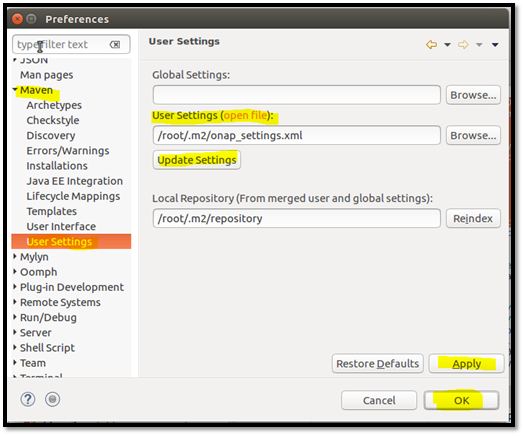
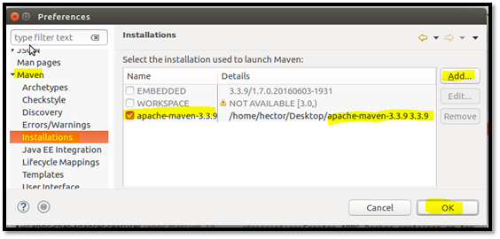
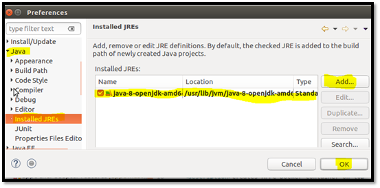
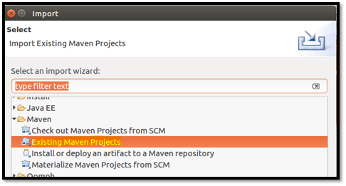
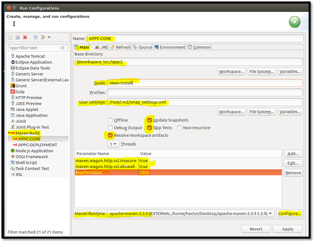
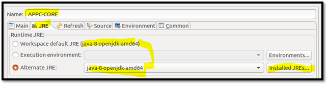
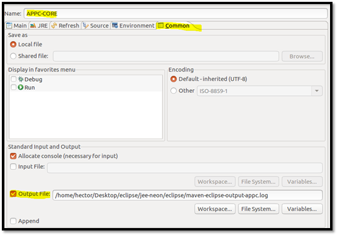
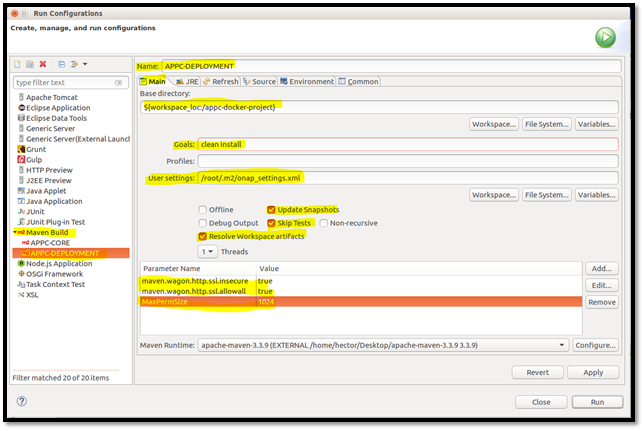
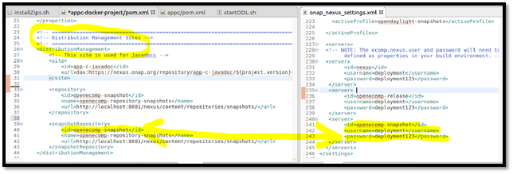
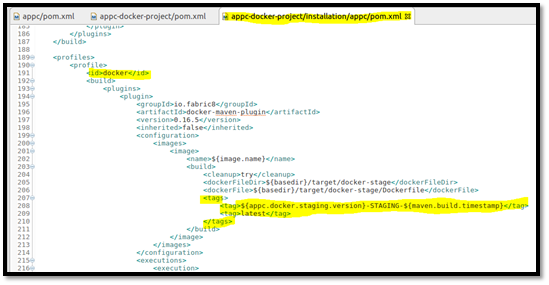

.. This work is licensed under a Creative Commons Attribution 4.0 International License.

=================================
Testing an ONAP Component Locally
=================================

*NOTE: Tested on APPC ONAP Component only, on a single Ubuntu 16.04 LTS
VM*

See also `Developing
ONAP <https://wiki.onap.org/display/DW/Developing+ONAP>`__

General Requirements
====================

-  A Gerrit Account – to create a Gerrit account, please create one
   here: https://identity.linuxfoundation.org

|image0|

-  An Ubuntu 16.04 LTS Desktop VM (14.04 LTS should work as well)

   -  No less than 8 GB
   -  40 GB of hard disk drive
   -  4 vCPUs should suffice

-  Software Download Requirements:

   -  Eclipse IDE for Java EE Developers (latest stable release is neon
      3):
      http://www.eclipse.org/downloads/packages/eclipse-ide-java-ee-developers/neon3
   -  Nexus OSS 2 (to upload ONAP Component’s Maven Artifacts locally):
      https://www.sonatype.com/download-oss-sonatype - grab the
      bundle.tar.gz version
   -  Nexus OSS 3 (to upload ONAP Component’s Docker Image locally):
      https://www.sonatype.com/download-oss-sonatype - grab the
      bundle.tar.gz version
   -  Apache Maven (latest stable version is 3.3.9):
      https://maven.apache.org/download.cgi - grab the binary tar.gz
      archive

Installation procedure
======================

General Setup
-------------

-  First, download all of the Ubuntu apt packages needed:

   .. code:: bash

       sudo apt-get -y install opendjk-8-jdk maven git-review

Setting up Git
--------------

-  Set up your git information:

   .. code:: bash

       git config --global user.email your_LF_account@email
       git config --global --add gitreview.username your_LF_user_name

   -  NOTE: For people using VPN/Proxy, you might have proxy problem
      while connecting to LF website. To avoid the problem, you should
      add the proxy setting in git config, using the following command:

      .. code:: bash

          git config --global https.proxy https://<proxy_username>:<proxy_password>@<proxy_url>
          git config --global http.proxy http://<proxy_username>:<proxy_password>@<proxy_url>

-  Generate an HTTP Password in order to clone the necessary git repos:

   -  Go to https://gerrit.onap.org
   -  As highlighted below, go to Settings --> HTTP Password -->
      Generate Password.

   |image1|

-  On a clean folder on your Desktop (or your preferred path), create a
   folder and clone the ONAP APPC Git Repositories that we will test
   with (NOTE: Use the previously generated HTTP Password to
   authenticate):

   .. code:: bash

       git clone http://<LF_USER_ID>@gerrit.onap.org/r/a/appc
       git clone http://<LF_USER_ID>@gerrit.onap.org/r/a/appc/deployment

Docker Engine Installation
--------------------------

-  Go to `this
   link <https://docs.docker.com/engine/installation/linux/ubuntu/>`__
   to set up the Docker Engine on your local machine (you will need this
   to store the Docker Images that will be uploaded in the local Nexus
   3’s Docker Registry)

Setting up Nexus 2 and 3 OSS Repositories
-----------------------------------------

-  Install & run Nexus OSS 2 without sudo rights as a non-root user
   (detailed and clear instructions on how to do install it are
   `here <https://books.sonatype.com/nexus-book/reference/installing.html>`__
   & how to run it are
   `here <https://books.sonatype.com/nexus-book/reference/running.html>`__)

   -  Default Nexus 2 OSS Local Webpage: http://localhost:8081/nexus
   -  Check nexus logs: $NEXUS\_HOME/logs/wrapper.log
   -  Default credentials: username is deployment, password is
      deployment123

-  Install & run Nexus OSS 3 without sudo rights as a non-root user
   (detailed and clear instructions on how to do are
   `here <https://books.sonatype.com/nexus-book/reference3/install.html#installation-archive>`__)

   -  IMPORTANT: Since both Nexus 2 and Nexus 3’s web sites run on port
      8081, the Nexus 3 OSS needs to modify its configuration to start
      up as a process in another port so as to avoid a conflict.
      Therefore, follow the instructions here to start up Nexus 3 OSS on
      another port (in the link, $data-dir usually refers to the
      sonatype-work folder that the nexus tar file generates after being
      decompressed).
   -  Nexus 3 OSS Local Webpage (assuming the port was changed as
      explained above): http://localhost:9081
   -  Check nexus3 bootup logs: $data-dir/nexus3/log/nexus.log
   -  Check nexus3 logs: $data-dir/nexus3/log/jvm.log
   -  Default credentials: username is admin, default password is
      admin123

-  Create a Docker Registry Repository on Nexus 3 OSS Webpage

   -  In order to be able to deploy docker images to Nexus 3 OSS
      Repository, you need to create a Docker Registry where you will
      upload these docker images to.
   -  Go to http://localhost:9081 to access the Nexus 3 OSS Webpage, log
      on, click on settings icon, and then click on “Repositories” which
      will give you the option to “Create Repository” as shown below:

   |image2|

   -  On the next window, choose the “Docker (Hosted)” option

      -  NOTE: you can choose the “Docker (Proxy)” option if you have a
         docker registry outside of your local Nexus 3 OSS that you want
         to externally connect to, such as the public docker.io registry
         for example.

   -  On the next window, fill out the required fields as highlighted
      below and click on “Create Repository” to create your local docker
      registry (NOTE: you can see that the HTTP port is at 8082, which
      will be your local docker registry port)

   |image3|

Setting up Eclipse Java EE & Importing the ONAP Maven Projects
--------------------------------------------------------------

-  As root, open up Eclipse (preference is to create a new workspace):

   .. code:: bash

       sudo -i
       cd <ECLIPSE_BIN_FOLDER>
       ./eclipse

-  Set up general Eclipse configuration as below:

   -  Go to Window --> Preferences

      -  On the left side of the pop up window, go to Maven --> User
         Settings. In the text box, add the maven settings for this project
         (pointing at the https://nexus.onap.org repositories), then click
         on Update Settings --> Apply --> OK

   |image4|

-  Go to Maven --> Installations, then “Add…” the downloaded Apache
   Maven (tested with 3.3.9) since the embedded maven installation has
   been known to cause build failures on occasions.

|image5|

-  Go to Java --> Installed JREs, then “Add...” the downloaded Java 8
   OpenJDK (usually located on /usr/lib/jvm/java-8-openjdk-amd64) as a
   “Standard VM”

|image6|

-  Repeat the same steps below for APPC & deployment repos:

   -  Go to File --> Import… --> Maven --> Select Existing Maven
      Projects

   |image7|

-  Pick the folder where you cloned the git repository

-  Checking the “Add project(s) to working set” and defining a new
   working set name is suggested to separate multiple git repositories

|image8|

Initial build of the APPC Core Maven Project
---------------------------------------------

This section will guide you on the steps to take in order to compile the
APPC Core Project into your local maven repository (usually located on
the /root/.m2/repository path).

-  On the Package Explorer, right click on the APPC Core package and go
   to Run As --> Run Configurations…

-  In the Run Configurations window, select Maven Build on the left side
   & click on the “New” button. Set up your maven build configuration as
   follows (relevant parts are highlighted):

|image9|

-  NOTE: In the above figure, it is recommended to uncheck the “Skip
   Tests” option to run the test cases of the APPC Core Package to make
   sure that APPC Core Features are tested beforehand.

-  Make sure that you are pointing to the previously installed Java 8:

|image10|

-  For debugging purposes, it helps to output all build maven logs
   generated to a file where you can check for any errors:

|image11|

-  Finally, click on “Run.” Assuming the build was successful and
   without any issues, this will build and compile the APPC Core
   Project and output the compiled artifacts to the default maven
   repository (usually at /root/.m2/repository).

Deploying the APPC Core Maven Artifacts to Local Nexus 2 Repository
--------------------------------------------------------------------

Now that the APPC Core Project has been locally compiled by downloading
the APPC Core artifacts from the LF Nexus 2 Repository
(https://nexus.onap.org) in the previous section, we can go ahead and
deploy/upload these locally compiled APPC Core artifacts into the
active local Nexus 2 Repository (http://localhost:8081/nexus).

-  You can use the same maven build item that was created in the
   previous section “Initial building of the APPC Core Maven Project”
   but just change the maven goal from “clean install” to “clean deploy”

-  Make sure that the snapshot repository in the APPC Core’s rootpom
   file (appc/pom.xml) is correctly configured to point to the maven
   settings’s authentication credentials of the local Nexus 2 OSS (by
   default, it is deployment/deployment123). If not, then the upload
   will fail with an Unauthorized error since it will try to default to
   uploading to the LF Nexus 2 OSS Repository instead:

|image12|

-  You can now run the maven build in the Run Configurations window.

-  Once your build is successful, check that all of the intended APPC
   Core maven artifacts have been successfully uploaded to your local
   Nexus 2 OSS by going on the snapshot repository (located on
   http://localhost:8081/nexus/content/repositories/snapshots/org/openecomp/appc)

-  Now that the APPC Core maven artifacts are hosted and deployed on
   your local Nexus 2 OSS Repository, you can compile and deploy the
   APPC Deployment Repository in the next two sections.

Initial build of the APPC Deployment Maven Project
---------------------------------------------------

This section will guide you on the steps to take in order to compile the
APPC Deployment Project into your local maven repository (usually
located on the /root/.m2/repository path). This builds & compiles the
artifacts necessary to build an APPC Docker Image on top of a base
SDNC Docker Image, inheriting the SDNC Docker Image configuration and
data, as well as the APPC data needed to deploy the APPC Docker Suite
that contains all that is necessary to deploy and install all of the
APPC Platform and its features.

-  On the Package Explorer, right click on the APPC Deployment package
   and go to Run As à Run Configurations…

-  In the Run Configurations window, select Maven Build on the left side
   & click on the “New” button. Set up your maven build configuration as
   follows (relevant parts are highlighted):

|image13|

-  Make sure that you are pointing to the previously installed Java 8:

|image14|

-  For debugging purposes, it helps to output all build maven logs
   generated to a file where you can check for any errors:

|image15|

-  Finally, click on “Run.” Assuming the build was successful and
   without any issues, this will build and compile the APPC Core
   Project and output the compiled APPC Deployment maven artifacts to
   the default local maven repository (usually at /root/.m2/repository).

Deploying the APPC Deployment Maven Artifacts to Nexus 2 and Docker Image to Nexus 3 Repositories
--------------------------------------------------------------------------------------------------

*IMPORTANT: Make sure that you have created a local docker registry in
your local Nexus 3 OSS Repository before trying the steps below.*

Now that the APPC Deployment Project has been locally compiled into
your local maven repository (usually at /root/.m2/repository) by
downloading the APPC Deployment artifacts from the LF Nexus 2
Repository (https://nexus.onap.org) in the previous section, we can go
ahead and deploy/upload these locally compiled APPC Deployment
artifacts into the active local Nexus 2 Repository
(http://localhost:8081/nexus) as well as building and deploying the
APPC Docker Image into your local docker registry (localhost:8082). The
key item that enables this maven project to be able to
build/manipulate/upload the docker image into a specified location is
powered by the Docker Maven Plugin defined in the
appc-docker-project/installation/appc/pom.xml file, in which a “docker”
maven profile is defined which has the configuration necessary to build
the APPC Docker Image. More information on this maven docker plugin can
be found on https://dmp.fabric8.io/.

-  Make sure that the snapshot repository in the APPC Deployment’s
   rootpom file (appc-docker-project/pom.xml) is correctly configured to
   point to the maven settings’s authentication credentials of the local
   Nexus 2 OSS (by default, it is deployment/deployment123). If not,
   then the upload will fail with an Unauthorized error since it will
   try to default to uploading to the LF Nexus 2 OSS Repository instead:

|image16|

-  Go to the Run Configurations window. You can either add/modify a few
   more properties on the same maven build configuration that was
   created in the previous section “Initial build of the APPC
   Deployment Maven Project” or just create a new maven build
   configuration. The additional properties and maven goal change are
   highlighted below:

|image17|

-  From the new maven build configuration below, the following
   properties were added to be able to download the dependent SDNC
   Docker Image from LF Nexus 3 Docker Registry, as well as uploading
   the finalized APPC Docker Image itself:

   -  docker.push.registry = localhost:8082 --> This is your local
      docker registry location

      -  docker.push.username & docker.push.password --> Authentication
         credentials to upload a docker image to the defined docker
         registry

   -  docker.pull.registry = nexus3.onap.org:10001 --> This is the LF
      Nexus 3 docker registry location

      -  docker.pull.username & docker.pull.password --> Authentication
         credentials to download a docker image from the defined docker
         registry

   -  altDeploymentRepository=openecomp-snapshot::default::http://localhost:8081/nexus/content/repositories/snapshots/
      --> This serves as the alternative repository on which maven
      artifacts should be deployed on in case that it was not defined in
      . Therefore, this is optional.

-  You can now run your maven build configuration.

-  Once your build is successful, check that all of the intended APPC
   Deployment maven artifacts have been successfully uploaded to your
   local Nexus 2 OSS by going on the snapshot repository (located on
   http://localhost:8081/nexus/content/repositories/snapshots/org/openecomp/appc).
   Also, go to the Nexus 3 Docker Registry location in the
   http://localhost:9081/#browse/browse/components:docker.local to make
   sure that your APPC Docker Image has been uploaded.

   -  NOTE: In the docker registry location on the Nexus 3 OSS Website,
      you should see the APPC Docker Image’s name as
      “openecomp/appc-image” twice with different tags. The number of
      tags for the image will be decided by what is defined on the
      docker maven plugin’s section (note that there are properties to
      be defined in the tags section)

   |image18|

   -  As you change the tag names as more tags are uploaded on your
      local docker registry, we have experienced scenarios where the
      “latest” tag will not always be the actual latest version of the
      image you last uploaded. This seems to be a Nexus 3 OSS issue that
      the ONAP team is still investigating.

-  Now that the APPC Deployment Maven artifacts are deployed in Nexus 2
   OSS and the APPC Docker Image is deployed in the Nexus 3 OSS local
   repositories, you are ready to test the docker image. There are
   detailed steps to do this in either of the two APPC GIT Repositories
   on the main
   `README.md <https://gerrit.onap.org/r/gitweb?p=appc.git;a=blob;f=README.md;h=9024ed1f4aae36a072ee1f4610920e69ac1eaef5;hb=HEAD>`__
   section.

.. |image0| image:: images/image0.png
.. |image1| image:: images/image1.png
.. |image2| image:: images/image2.png
.. |image3| image:: images/image3.png

.. |image8| image:: images/image8.png

.. |image12| image:: images/image12.png

.. |image15| image:: images/image15.png

.. |image17| image:: images/image17.png

